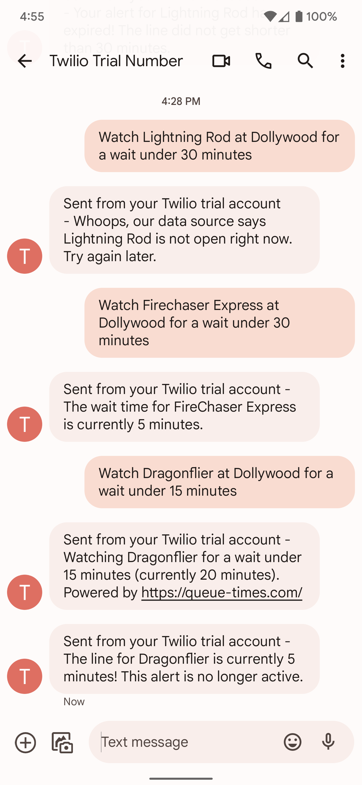
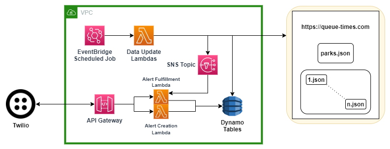
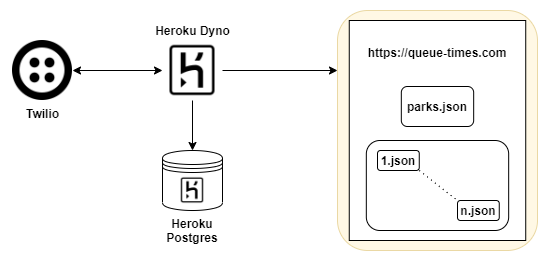

# Building Firewatch: an SMS Application for Theme Park Wait Times

Casey Johnson, Spring 2022 | [GitHub Repo](https://github.com/caseyjohnsonwv/queue-times-app/) | [Connect with me on LinkedIn!](https://linkedin.com/in/caseyjohnsonwv)

---

## Abstract

In this Gist, I conceive, architect, and deploy an SMS application called **Firewatch** that messages me when the lines are short at theme parks. This is a Python 3.10 application leveraging [FastAPI](https://fastapi.tiangolo.com/) and [Twilio](https://www.twilio.com/) with amusement park data sourced from [Queue-Times](https://queue-times.com/). The chosen architecture prioritizes simplicity and cost-savings over efficiency. As such, Firewatch costs approximately $10 per month to operate.

<p align="center">
  
</p>

I must give name attribution to the video game [Firewatch](https://www.firewatchgame.com/) - it is one of my favorites.

---

## Conception

Suppose you visit your nearest theme park on a typical summer day: 11am opening, 8pm closing. In those 9 hours, most rides will have wait times of 20-30 minutes or more. Even after removing time for meals, walking, and actually riding the rides, you will still spend upwards of 3-4 hours that day waiting in line. On a *good* day. Skip-the-line passes are available, but not accessible: $250 on the busiest days at Cedar Point in 2021. So this begs the question: what if you didn't have to wait in long lines OR spend money on ride passes?

Enter [Queue-Times](https://queue-times.com/). Queue-Times not only uses historical data to predict crowd volumes at 100+ amusement parks - they also provide real-time wait times for each park, updated every 5 minutes.

Many parks now offer iPhone/Android apps with maps, wait times, and more. However, each app offers a variety features and functions (and varying degrees of usability). These apps are the data source for Queue-Times. So, let's kill two birds with one stone:
1. Rather than downloading an app for each park, build **one application for all parks** leveraging Queue-Times.
2. Rather than having to check an app or website, build a notification system that **tells me** when the line is short for the ride I want to ride.

And thus the Firewatch project was born.

---

## Architecture

When I set out to build this application, I knew it needed two things:
1. API routes to accept incoming SMS messages via Twilio.
2. Cronjobs to update wait times and send alert notifications.

Initially, I explored a serverless architecture on AWS:

<p align="center">
  
</p>

This was quickly shot down due to the sheer complexity it would introduce for such a small application. Simply put, it was more infrastructure than I wanted to manage, even with Terraform. The simplest architecture would be a long-running application with both API and scheduled job capabilities. I settled on AWS Fargate and DynamoDB, connected by an IAM role. This at least reduced Firewatch to one container.

After successfully deploying the application on AWS Fargate, I noticed the bill rising faster than I expected. Within a week, I pivoted to Heroku.

<p align="center">
  
</p>

This configuration is able to run free for life. However, free-tier dynos are subject to sleeping after 30 minutes of inactivity. This means the background tasks to fetch and update ride wait times would not run unless the app was actively being used. As such, I upgraded to the `hobby` dyno type, which never sleeps for only $7/mo.

Switching from AWS to Heroku had two unintended consequences, both overwhelmingly positive:
1. Drastic simplification of the IaC configuration - Heroku deals with AWS; I deal with the code.
2. Simplification of automated code deployments without additional build tools, as described below.

---

## Deployment

Rather than using Docker images, Heroku creates a git remote for each project. The project can be configured to automatically deploy the `main` branch after each push. Thus, with a little `local-exec` magic, I am able to deploy the latest code on my local branch with `terraform apply`. The simplicity of this method is perfect for my hobby use.

```
resource "null_resource" "deployment_script" {
  provisioner "local-exec" {
    interpreter = [ "bash", "-c" ]
    command     = "git push heroku $(git branch | grep \\* | cut -d \"*\" -f2 | sed 's/^ *//g'):main --force"
  }

  triggers = {
    # trigger on every apply
    deploy_time = timestamp(),
  }

  ...
}
```

All infrastructure is managed in one file: `infrastructure/runtime.tf`. Once the app is created, Terraform outputs a target URL for Twilio webhooks. This must be manually updated in the Twilio console. The target URL does not change unless the Heroku project name changes, so this is typically a one-time activity.

Twilio resources can also be managed via Terraform, but the provisioning and de-provisioning of phone numbers when testing would drain Twilio's $20 credit for new accounts. Inclusion of Twilio resources in the IaC configuration would be a logical next step to create a production-ready application. 

---

## Application Code

I am leveraging the Python framework `FastAPI` as well as the background task library `APScheduler`. This allows the same container to handle POST requests to/from Twilio *and* send periodic GET requests to the Queue-Times data source. Environment variables are set when standing up the application with Terraform.

### API
Firewatch uses a single API endpoint to accept incoming POST requests from Twilio. This endpoint:
1. Verifies the request's authenticity with the `X-Twilio-Signature` header.
2. Uses natural language processing to determine if an alert is being created, modified, or deleted.
3. Extracts the relevant park name, ride name, allowable wait time, etc. from the end user's message.
4. Performs CRUD operations according to the information extracted in steps 2 & 3.
5. Returns a new message for Twilio to use as its SMS reply to the end user.

I opted to build two different API routers: a production router following this exact flow; and a test router omitting request verification. The test router is conditionally mounted into the app on startup:

```
app = FastAPI()
app.include_router(live_router)
if env.ENV_NAME == 'local':
    app.include_router(test_router)
```

With the test router, iterating on the application is as simple as running `python3 app.py`, opening `localhost:5000/docs` in the browser, and sending requests from the Swagger UI that is automatically generated by FastAPI.

### Background Tasks

Firewatch runs three distinct background tasks:

1. Syncing our list of supported theme parks with Queue-Times. This is a simple job, fetching one `.json` file once per week. I opted for Mondays at midnight UTC. If a park ceases to be supported, its wait times and active alerts are cascade-deleted by the database. Queue-Times supports parks around the world; we currently support US theme parks only, as Heroku Postgres caps its free tier at 10,000 rows of data.

2. Fetching ride wait times (also `.json` files) from Queue-Times and updating our database. This job runs every 5 minutes to update all wait times for all rides at all supported parks. The job sometimes takes over 5 minutes to execute. I am currently using only 1 thread in production to minimize impact on the data source; the APScheduler library is configured **not** to start a new execution of this job if the last is still running. Multithreading is enabled to accelerate this job, but only in use for local testing.

3. Notifying users for any fulfilled or expired alerts. This job iterates over every park in the database and uses two-pointer logic to step through each open alert and ride in linear time. (Each ride and alert must be examined, but at least each one is only examined once.) If the alert is expired or its condition has been met, a message is sent to the end user using Twilio's Python library. This job runs 1 minute prior to the fetch/update job to maximize the number of alerts closed every 5 minutes.

---

## Evaluation

Development and testing of the application is ongoing, but its MVP has already proven useful at Dollywood in Pigeon Forge, TN. During my first visit to the park in May of 2022, I used Firewatch while my friend used Dollywood's app. Firewatch was able to accurately report on ride closures and wait times only minutes behind what we were seeing in-person. But more importantly, Firewatch **sent me notifications before we even checked Dollywood's app**.

Unfortunately, this application does still have one major limitation: its data. Queue-Times is a fantastic free source, but its data comes *from* amusement park apps, meaning we cannot be more accurate than the parks themselves. But, as parks' own apps improve, so too will Queue-Times, and thus Firewatch.

At the time of writing, I do not plan to make Firewatch a production-grade application. This was built primarily for my own exposure to AWS resources via Terraform prior to taking HashiCorp's certification exam. I do plan to continue iterating on the application, but only as a side project for show-and-tell purposes.

---

## Contact

Feel free to message me on LinkedIn with any questions, comments, or concerns! The link is at the top of this Gist.

##### Casey Johnson, Spring 2022